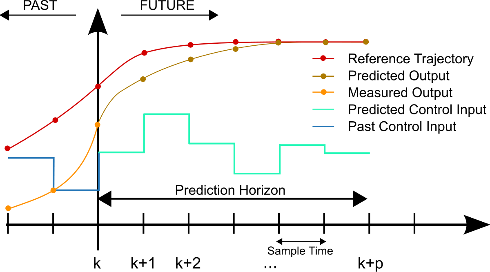

# CarND-Controls-MPC
Self-Driving Car Engineer Nanodegree Program

[1]: https://en.wikipedia.org/wiki/Model_predictive_control

Model predictive control (MPC) is a well-established technology for advanced
process control (APC) deployed in many industrial applications. In this project
MPC is implemented to drive the car in a simulator. While driving automatically
steer angle and throttle actuators are controlled. Typically a self driving car
consist of following:

* Perception - to identify suroundings
* Localization - to localize itself on the map
* Path planing - to provide the route to follow
* Control - controls the vehicle to follow the route as provided by path planing

In this project the Control part is implemented with MPC approach.
Path planing is provided by the simulator. The below picture illustrates the
functionality of MPC. The reference trajectory is the path as provided by the
path planing module, the predicted output is the responsibility of MPC. Prediction
Horizon is the time MPC predicts into the future. After the time amount k prediction
takes place with new state and the horizon moves by amount of k into future (receding horizon). MPC tries to find the optimal trajectory with minimum costs.
Once the optimum trajectory is found the MPC will also provide new inputs to actuators.

 A discrete MPC scheme [[1]]


---

## Dependencies

* cmake >= 3.5
 * All OSes: [click here for installation instructions](https://cmake.org/install/)
* make >= 4.1(mac, linux), 3.81(Windows)
  * Linux: make is installed by default on most Linux distros
  * Mac: [install Xcode command line tools to get make](https://developer.apple.com/xcode/features/)
  * Windows: [Click here for installation instructions](http://gnuwin32.sourceforge.net/packages/make.htm)
* gcc/g++ >= 5.4
  * Linux: gcc / g++ is installed by default on most Linux distros
  * Mac: same deal as make - [install Xcode command line tools]((https://developer.apple.com/xcode/features/)
  * Windows: recommend using [MinGW](http://www.mingw.org/)
* [uWebSockets](https://github.com/uWebSockets/uWebSockets)
  * Run either `install-mac.sh` or `install-ubuntu.sh`.
  * If you install from source, checkout to commit `e94b6e1`, i.e.
    ```
    git clone https://github.com/uWebSockets/uWebSockets
    cd uWebSockets
    git checkout e94b6e1
    ```
    Some function signatures have changed in v0.14.x. See [this PR](https://github.com/udacity/CarND-MPC-Project/pull/3) for more details.

* **Ipopt and CppAD:** Please refer to [this document](https://github.com/udacity/CarND-MPC-Project/blob/master/install_Ipopt_CppAD.md) for installation instructions.
* [Eigen](http://eigen.tuxfamily.org/index.php?title=Main_Page). This is already part of the repo so you shouldn't have to worry about it.
* Simulator. You can download these from the [releases tab](https://github.com/udacity/self-driving-car-sim/releases).
* Not a dependency but read the [DATA.md](./DATA.md) for a description of the data sent back from the simulator.


## Basic Build Instructions

1. Clone this repo.
2. Make a build directory: `mkdir build && cd build`
3. Compile: `cmake ../src && make`
4. Run it: `./mpc`.

## Editor Settings

We've purposefully kept editor configuration files out of this repo in order to
keep it as simple and environment agnostic as possible. However, we recommend
using the following settings:

* indent using spaces
* set tab width to 2 spaces (keeps the matrices in source code aligned)
* Eclipse ide can be used, see ide_profiles folder how to generate and import
  the project

## Code Style

Please (do your best to) stick to [Google's C++ style guide](https://google.github.io/styleguide/cppguide.html).
