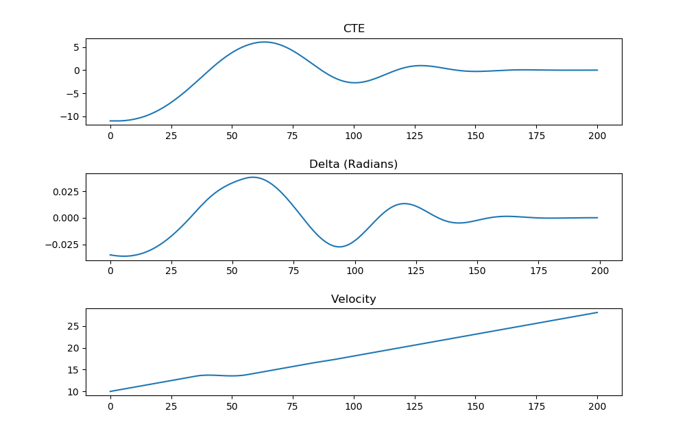

# CarND-Controls-MPC
Self-Driving Car Engineer Nanodegree Program

[1]: https://en.wikipedia.org/wiki/Model_predictive_control

### Introduction and theory

Model predictive control (MPC) is a well-established technology for advanced
process control (APC) deployed in many industrial applications. In this project
MPC is implemented to drive the car in a simulator. While driving automatically
steer angle and throttle actuators are controlled. Typically a self driving car
consist of following:

* Perception - to identify suroundings
* Localization - to localize itself on the map
* Path planing - to provide the route to follow
* Control - controls the vehicle to follow the route as provided by path planing

In this project the Control part is implemented with MPC approach.
Path planing part is provided by the simulator. The below picture illustrates the
discrete scheme of MPC. The reference trajectory is the path as provided by the
path planing module, the predicted output is the responsibility of MPC. Prediction
Horizon is the time MPC predicts into the future. After the time amount k prediction
takes place with a new state available at k+1 and the horizon moves by amount of k into future (receding horizon). MPC tries to find the optimal trajectory with minimum costs. Idealy the predicted trajectory should converge so that the error CTE (Cross Trajectory Error) between reference and predicted trajectory is minimal. Once the optimum trajectory is found the MPC will also provide new inputs to actuators.

 A discrete MPC scheme [[1]]

### Vehicle Model
In this project we work wit a simple so called Kinematic Model. The state of a vehicle
is described with following parameters:

* x - x coordinate of the car
* y - y coordinate of the car
* ψ - orientation of the car  
* v - speed of the car

Actuators or control inputs to the vehicle:
* δ - steering angle
* a - throttle

The state evolves through time by following formulas:


L​f is a physical characteristic of the vehicle.

MPC will try to minimize the CTE and Orientation Errors during runtime.
The Errors evolve through time by following formulas:


### Implementation
To implement the MPC following steps were addressed:
* Set N and dt
* Fit the polynomial to the waypoints
* Calculate initial cross track error and orientation error values
* Define the components of the cost function (state, actuators, etc)
* Define the model constraints.

To solve optimization problem ipopt and CppAD libraries were used.

#### Adding delay
One additional task was to model a delay of 100ms into final MPC solution.
This would simulate a delayed command propagation through vehicle buses.
Considering the vehicle model described above the delay can be coded as below:

```
// add 100ms latency, in seconds
const double latency = 0.1;
const long int sleep_delay = 1000 * latency;

double px_delay = v*latency;
double py_delay = 0;
double psi_delay = -v*delta*latency/Lf;
double epsi_delay = -atan(coeffs[1]) + psi;
double cte_delay = cte + (v*sin(epsi)*latency);
double v_delay = v + throttle*latency;
```
Simulating propagation of actuation commands through vehicle buses:

```
//Sleep 100ms before sending the actuation commands to the simulator

this_thread::sleep_for(chrono::milliseconds(sleep_delay));
ws.send(msg.data(), msg.length(), uWS::OpCode::TEXT);

```
### Tuning MPC parameters
To find ideal parameters the simulator was used to see the behavior of the car
driving around.

Setting N and dt:

```
// Set N and dt -> T = N * dt
size_t N = 10;
double dt = 0.1;

```
In this project the Prediction horizon is 1 second long.

Additional tuning was achieved through cost function.
```
for (int t = 0; t < N; t++) {
  fg[0] += 500 * CppAD::pow(vars[cte_start + t], 2);
  fg[0] += 500 * CppAD::pow(vars[epsi_start + t], 2);
  fg[0] += CppAD::pow(vars[v_start + t] - ref_v, 2);
}

// Minimize the use of actuators.
for (int t = 0; t < N - 1; t++) {
  fg[0] += 100000 * CppAD::pow(vars[delta_start + t], 2);
  fg[0] += 50 * CppAD::pow(vars[a_start + t], 2);
}

for (int t = 0; t < N-2; t++) {
  fg[0] +=  1000000 * CppAD::pow(vars[delta_start + t + 1] - vars[delta_start + t], 2);
  fg[0] +=  100 * CppAD::pow(vars[a_start + t + 1] - vars[a_start + t], 2);
}
```
Multiplication factors influence the solver into keeping sequential values closer together.
To avoid sharp steering changes a high multiplication factor 100000 is chosen.

### Simulating parameters
The chosen parameters were simulated on simplified line model with 200 cycles.
The plot of CTE, steering deltas and velocity is presented below:



---

## Dependencies

* cmake >= 3.5
 * All OSes: [click here for installation instructions](https://cmake.org/install/)
* make >= 4.1(mac, linux), 3.81(Windows)
  * Linux: make is installed by default on most Linux distros
  * Mac: [install Xcode command line tools to get make](https://developer.apple.com/xcode/features/)
  * Windows: [Click here for installation instructions](http://gnuwin32.sourceforge.net/packages/make.htm)
* gcc/g++ >= 5.4
  * Linux: gcc / g++ is installed by default on most Linux distros
  * Mac: same deal as make - [install Xcode command line tools]((https://developer.apple.com/xcode/features/)
  * Windows: recommend using [MinGW](http://www.mingw.org/)
* [uWebSockets](https://github.com/uWebSockets/uWebSockets)
  * Run either `install-mac.sh` or `install-ubuntu.sh`.
  * If you install from source, checkout to commit `e94b6e1`, i.e.
    ```
    git clone https://github.com/uWebSockets/uWebSockets
    cd uWebSockets
    git checkout e94b6e1
    ```
    Some function signatures have changed in v0.14.x. See [this PR](https://github.com/udacity/CarND-MPC-Project/pull/3) for more details.

* **Ipopt and CppAD:** Please refer to [this document](https://github.com/udacity/CarND-MPC-Project/blob/master/install_Ipopt_CppAD.md) for installation instructions.
* [Eigen](http://eigen.tuxfamily.org/index.php?title=Main_Page). This is already part of the repo so you shouldn't have to worry about it.
* Simulator. You can download these from the [releases tab](https://github.com/udacity/self-driving-car-sim/releases).
* Not a dependency but read the [DATA.md](./DATA.md) for a description of the data sent back from the simulator.


## Basic Build Instructions

1. Clone this repo.
2. Make a build directory: `mkdir build && cd build`
3. Compile: `cmake ../src && make`
4. Run it: `./mpc`.

## Editor Settings

We've purposefully kept editor configuration files out of this repo in order to
keep it as simple and environment agnostic as possible. However, we recommend
using the following settings:

* indent using spaces
* set tab width to 2 spaces (keeps the matrices in source code aligned)
* Eclipse ide can be used, see ide_profiles folder how to generate and import
  the project

## Code Style

Please (do your best to) stick to [Google's C++ style guide](https://google.github.io/styleguide/cppguide.html).
